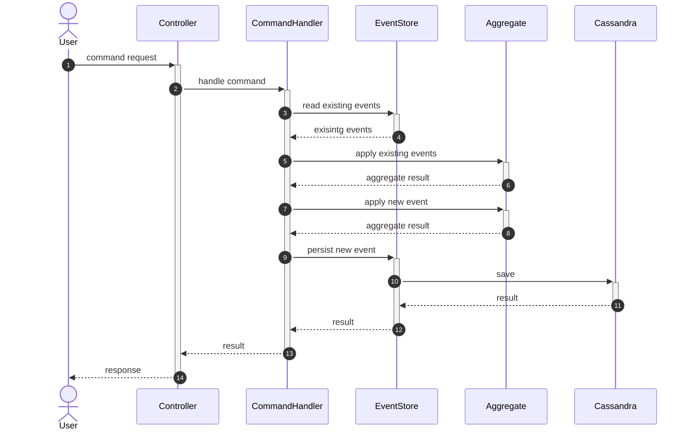
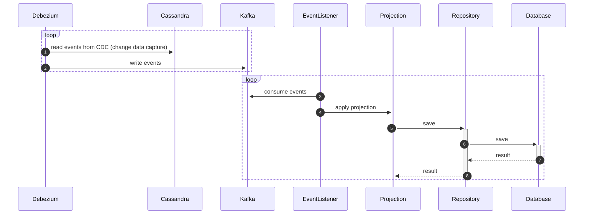
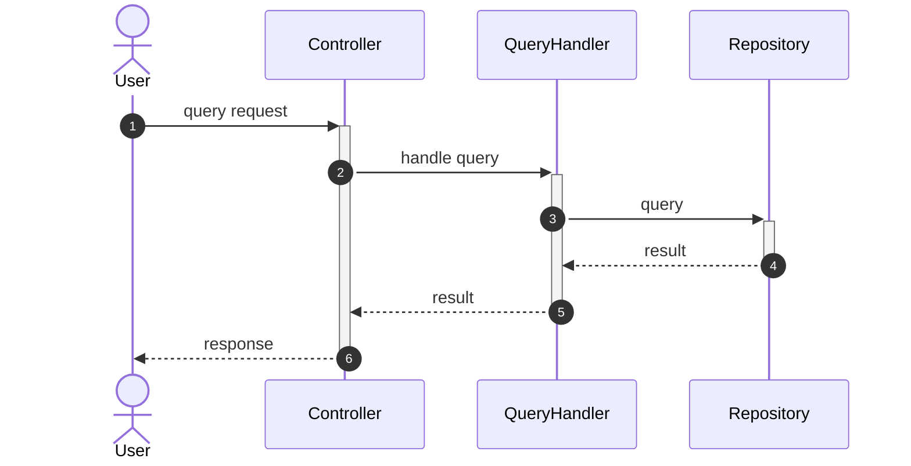
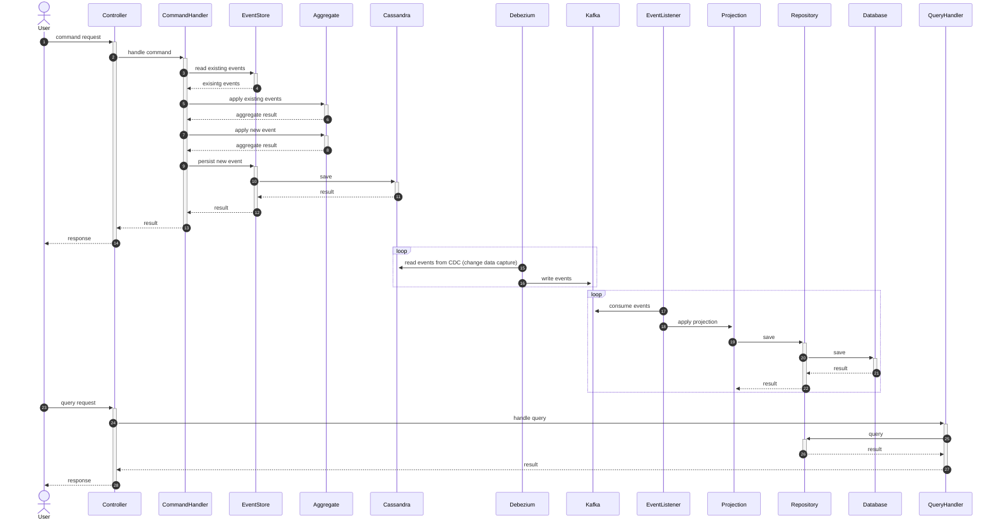

# event-sourcing-rs

🚧 This library is under construction! 🚧

## Summary

An opinionated event sourcing library that is designed to be focused on speed, durability, and ease of use.

## Setup

### Prerequisites

- Apache Cassandra or ScyllaDB
  - Make sure to have CDC enabled
- Apache Kafka
- Debezium
  - Configured the Debezium Connector for Cassandra or ScyllaDB
- Any preferred database to store your projected states

Add the following dependencies to your `Cargo.toml`:
```toml
[dependencies]
event-sourcing = { git = "https://github.com/benjaminjacobberg/event-sourcing-rs" } # Core
event-store-cassandra = { git = "https://github.com/benjaminjacobberg/event-sourcing-rs" } # Cassandra event store implementation
event-stream-kafka = { git = "https://github.com/benjaminjacobberg/event-sourcing-rs" } # Kafka event stream implementation
```

## Diagrams

### Sequence Diagrams

#### Execute Command



#### Flow of Data to Projection



#### Query State



#### Entire Overview

